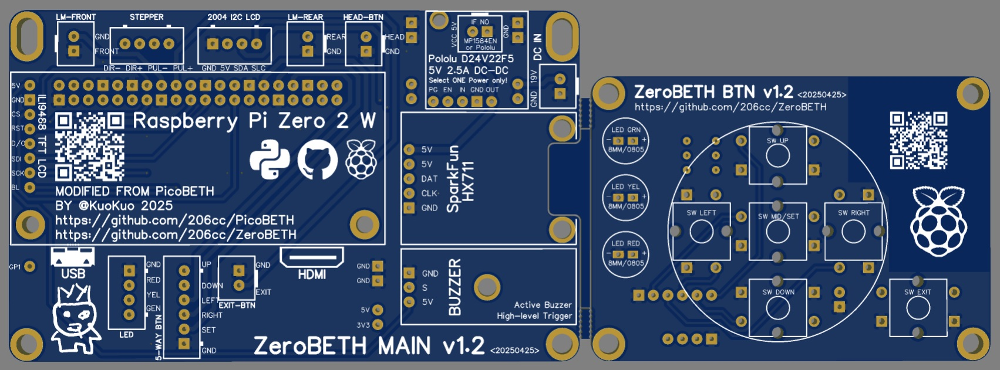
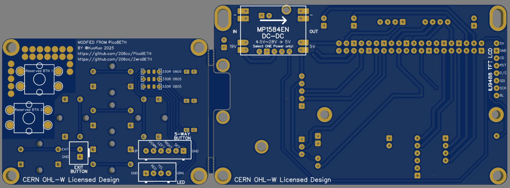
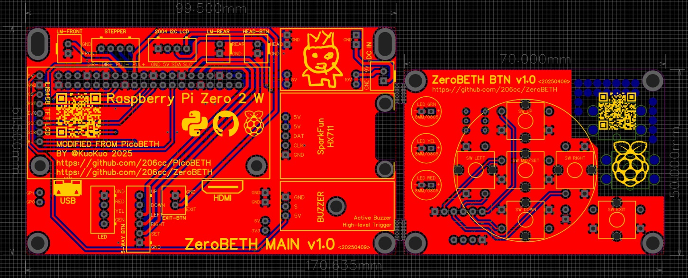

# ZeroBETH

ZeroBETH 是基於 [PicoBETH](https://github.com/206cc/PicoBETH) 的延伸版本，將主控器從 Raspberry Pi Pico 改為 Raspberry Pi Zero 2 W，提供更強大的效能與更多的擴充功能。此變體保留原有設計理念：經濟、直覺、精準，並針對進階使用者與開發者提供更高彈性。

> [!TIP]
> 目前仍在測試階段，待完善後將公開釋出

---

### 預覽影片

| 類別 | 說明 | 連結 |
|------|------|------|
| Stringing Demo | ZeroBETH 實際穿線操作展示 | [觀看影片](https://youtu.be/M76PxqrGcno) |
| Comparison Demo | ZeroBETH 與 PicoBETH 效能比較（開機速度、恆拉反應等） | [觀看影片](https://youtu.be/osMxNlAMeeI) |
| New UI Design | 全新 UI 操作介面（LCD 菜單重設與提升刷新率） | [觀看影片](https://youtu.be/-ikYBSZI7xk) |

---

## 硬體比較：Pico vs Zero 2 W

| 項目             | Raspberry Pi Pico W                   | Raspberry Pi Zero 2 W             |
|------------------|---------------------------------------|-----------------------------------|
| 處理器           | 雙核心 133MHz                         | 四核心 1GHz                       |
| 記憶體           | 264KB                                 | 512MB                             |
| 無線連接         | Wi-Fi 802.11n                         | Wi-Fi 802.11n                     |
| 儲存裝置         | 2MB                                  | microSD                           |
| 作業系統支援     | 無                                    | Linux 系統（Raspberry Pi OS）     |
| 價格（美元）     | 約 $7.00 USD                          | 約 $20.00 USD                     |

---

## PicoBETH 與 ZeroBETH 硬體差異

ZeroBETH 僅需更換 PicoBETH EP6 中的主機板與按鍵板，即可完成變更。

**PCB 製作 Gerber 檔案：**（待完測試完成後上傳）

### 成本差異

| 項目           | PicoBETH 成本 | ZeroBETH 成本       | 備註                     |
|----------------|---------------|----------------------|--------------------------|
| 主控板         | $7            | 約 $20.00            | 台灣零售市場價格         |
| 儲存裝置       | 無            | 約 $5（16GB microSD） | 最小容量即可             |

---

## PicoBETH 與 ZeroBETH 軟體差異

### PicoBETH：低成本且可靠

PicoBETH 已經過長期測試與使用者驗證，擁有穩定的效能與高性價比，對於不需進階功能的使用者，即可滿足需求。

### ZeroBETH：進階功能與開發友善

- **OTA 線上更新**：透過 Wi-Fi 自動下載與安裝更新檔案
- **更快畫面更新**：因效能提升使 LED 顯示畫面刷新更即時，UI 介面將重新設計
- **Samba 檔案共享**：可在區網中直接編輯程式碼與設定，無需透過傳輸線，方便開發

### ZeroBETH 軟體版本規劃

| 版本 | 顯示方式       | 說明                                                                 |
|------|----------------|----------------------------------------------------------------------|
| v1   | 2004 LCD        | UI 介面重新設計，功能與選單更完整                                   |
| v2   | 4" ILI9488 LCD  | 全彩 480x320 IPS LCD，提供更直觀與高級的圖形介面，在 v1 完善後接續開發 |

---

## 功能比較表

| 功能項目         | PicoBETH           | ZeroBETH           | 備註                                           |
|------------------|--------------------|--------------------|------------------------------------------------|
| 張力精度         | ±0.05 lb           | ±0.05 lb           | 張力平衡後的最大跳動範圍                       |
| 張力取樣頻率     | ≥80Hz              | ≥80Hz              | 取決於 SparkFun HX711 模組                    |
| 恆拉頻率         | 較低            | 較高            | 更快處理速度可提升張力恆拉反應                 |
| OTA 線上更新     | v2.80E以後韌體支援  | 支援               | 透過 Wi-Fi 更新韌體                            |
| UI 介面          | 極簡介面           | 全新設計           | v1: 2004 LCD，v2: 4" 全彩 IPS LCD              |

---

## 安裝指南

1. 請依照 [PicoBETH](https://github.com/206cc/PicoBETH) 專案說明製作機器本體。
2. 將 PicoBETH 中的 EP6 更換為 ZeroBETH 專用主板與按鍵板。
3. 將 ZeroBETH 韌體寫入 microSD 卡，插入 Zero 2 W 後按裝至機器上即可使用。

---

## 其他說明文件（ 規劃中）

> 以下文件仍在整理與撰寫中，完成後將補上詳細內容。

- 操作與設定指南
- 軟體建置與安裝

---

## 支援

有任何問題，請至 [PicoBETH 討論區](https://github.com/206cc/PicoBETH/discussions) 提出。

---

## 致謝

- [HX711 Raspberry Pi HX711 Python Bindings](https://github.com/endail/hx711-rpi-py)
- [RPI-PICO-I2C-LCD](https://github.com/T-622/RPI-PICO-I2C-LCD) 修改適用於 Raspberry Pi Zero 2W

---

## 授權

- **原始碼授權：** GNU General Public License v3.0 (GPLv3)  
- **硬體設計授權：** CERN Open Hardware Licence v2 – Weakly Reciprocal (CERN-OHL-W)
