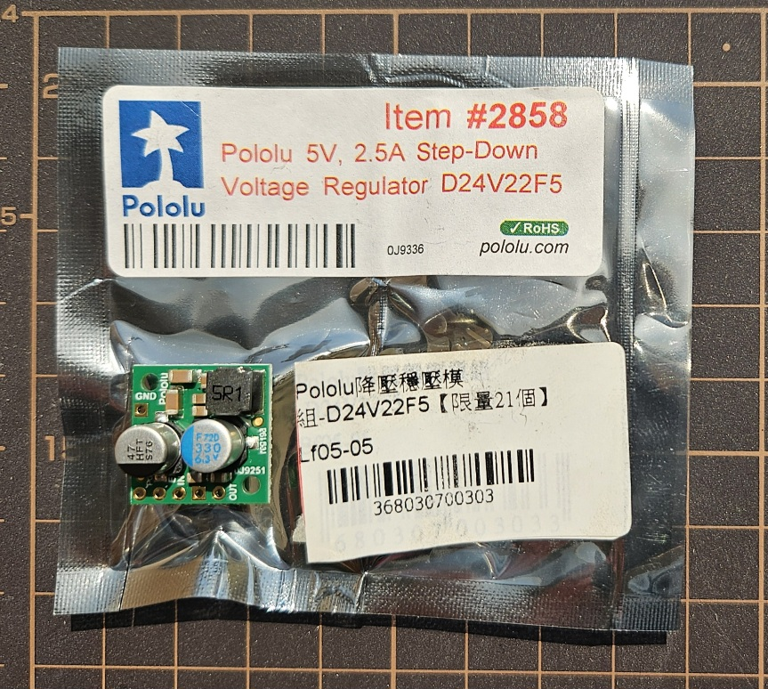
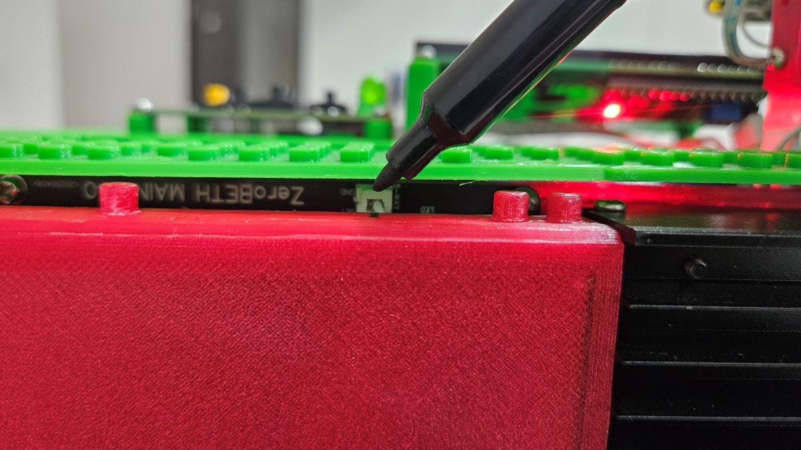
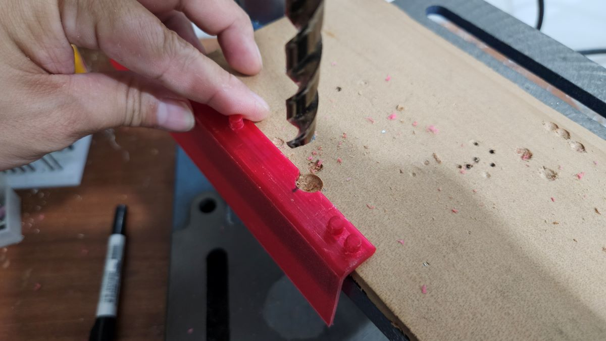

# ZeroBETH

ZeroBETH 是基於 [PicoBETH](https://github.com/206cc/PicoBETH) 的延伸版本，將主控器從 Raspberry Pi Pico 改為 Raspberry Pi Zero 2 W，提供更強大的效能與更多的擴充功能。此變體保留原有設計理念：經濟、直覺、精準，並針對進階使用者與開發者提供更高彈性。

> [!TIP]  
> **此為 Pre (預覽)版本**：此版本為開發中的測試版本，若遇到 Bug 或需要改進建議，請回報至專案的 GitHub 討論區。 

---

### 預覽影片

| 類別 | 說明 | 連結 |
|------|------|------|
| Stringing Demo | ZeroBETH 實際穿線操作展示 | [觀看影片](https://youtu.be/M76PxqrGcno) |
| Comparison Demo | ZeroBETH 與 PicoBETH 效能比較（開機速度、恆拉反應等） | [觀看影片](https://youtu.be/osMxNlAMeeI) |
| New UI Design | 全新 UI 操作介面（LCD 菜單重設與提升刷新率） | [觀看影片](https://youtu.be/-ikYBSZI7xk) |

---

## 硬體比較：Pico vs Zero 2 W

| 項目             | Raspberry Pi Pico W                   | Raspberry Pi Zero 2 W             |
|------------------|---------------------------------------|-----------------------------------|
| 處理器           | 雙核心 133MHz                         | 四核心 1GHz                       |
| 記憶體           | 264KB                                 | 512MB                             |
| 無線連接         | Wi-Fi 802.11n                         | Wi-Fi 802.11n                     |
| 儲存裝置         | 2MB                                  | microSD                           |
| 作業系統支援     | 無                                    | Linux 系統（Raspberry Pi OS）     |
| 價格（美元）     | 約 $7.00 USD                          | 約 $20.00 USD                     |

---

## PicoBETH 與 ZeroBETH 硬體差異

### Load Cell 傳感器

ZeroBETH 預設使用 NJ5 YZC-133 50kg Load Cell。若您使用 20kg Load Cell，請在工程選單中切換至 20kg 設定。

> [!CAUTION]
> 請注意，20kg 的 Load Cell 最大張力不得超過 40lb，否則可能導致永久性損壞。

### 滑台

ZeroBETH 預設搭配 SGX 1610 滑台。透過新的步進馬達驅動程式，在搭配 1610 螺杆滑台可實現高達 70lb 以上張力。

### 散熱片

由於 Pico 2W 的 Wi-Fi 模組封裝在 CPU 中，經測試發現，當 CPU 溫度超過 60 度時，Wi-Fi 可能會失效。建議加裝散熱片以提升散熱效能。當溫度超過 60 度時，系統將自動關閉 Wi-Fi 功能。如需重新啟用，可進入選單手動重啟 Wi-Fi。

### PCB 主板與按鍵板
ZeroBETH 僅需更換 PicoBETH EP6 中的主機板與按鍵板，即可完成變更。

**PCB 製作 Gerber 檔案：** [下載](docs/Gerber_ZeroBETH_1.2_2025-05-15.zip)  

#### DC-DC 5V 電源轉換器

由於市面上的 **MP1584EN** 模組品質參差不齊，不少劣質品在耗電較高的 **Raspberry Pi Zero 2W** 上，會因產生較大的 **紋波（ripple）** 而造成 **HX711 張力感測器出現飄移現象**。

因此，在 **ZeroBETH PCB 版本中**，特別設計了支援 **Pololu D24V22F5 高品質 DC-DC 電源模組** 的專用腳位。

若您發現使用 MP1584EN 時，**在待機狀態下經常出現超過 5g 的張力飄移**，可考慮：

- 嘗試更換其他供應商的 MP1584EN 模組，或  
- 直接改用 **Pololu D24V22F5 電源轉換器**，以提升穩定性。

此外，您也可以選擇：

- **直接使用 USB 供電**，或  
- **透過 PCB 上的 VCC IN 接口**，搭配其他 5V DC-DC 模組進行供電。

> [!NOTE]  
> 張力飄移現象不僅與供電有關，也可能與 HX711 放大器模組、Load Cell 感測器或接點阻抗等因素相關，建議選用品質優良的零件以確保穩定性。

  
與 SparkFun 的 HX711 模組類似，**正品的 Pololu D24V22F5 DC-DC 模組** 會附有原廠包裝袋與標籤貼紙，售價約為 10 美元。若遇到價格過低的產品，請留意是否為仿冒品。

#### BTN 按鍵板

ZeroBETH 的 BTN 按鍵板外觀與 PicoBETH 相同，但電路設計不同，無法相互通用。ZeroBETH 的按鍵採用上拉設計，而 PicoBETH 則採用下拉設計。

> [!CAUTION]
> 請注意，PicoBETH 的按鍵板不可用於 ZeroBETH。

---

## 成本差異

| 項目           | PicoBETH 成本 | ZeroBETH 成本       | 備註                     |
|----------------|---------------|----------------------|--------------------------|
| 主控板         | $7            | 約 $20.00            | 台灣零售市場價格         |
| 儲存裝置       | 無            | 約 $5（16GB microSD） | 最小容量即可             |
| CPU散熱       | 不需要          | 約 $1.5                | 建議，非必要 |

---

## PicoBETH 與 ZeroBETH 軟體差異

### PicoBETH：低成本且可靠

PicoBETH 已經過長期測試與使用者驗證，擁有穩定的效能與高性價比，對於不需進階功能的使用者，即可滿足需求。

### ZeroBETH：進階功能與開發友善

- **OTA 線上更新**：透過 Wi-Fi 自動下載與安裝更新檔案
- **更快畫面更新**：因效能提升使 LED 顯示畫面刷新更即時，UI 介面將重新設計
- **Samba 檔案共享**：可在區網中直接編輯程式碼與設定，無需透過傳輸線，方便開發

### ZeroBETH 軟體版本規劃

| 版本 | 顯示方式       | 說明                                                                 |
|------|----------------|----------------------------------------------------------------------|
| v1   | 2004 LCD        | UI 介面重新設計，功能與選單更完整                                   |
| v2   | 4" ILI9488 LCD  | 全彩 480x320 IPS LCD，提供更直觀與高級的圖形介面，在 v1 完善後接續開發 |

---

## 功能比較表

| 功能項目         | PicoBETH           | ZeroBETH           | 備註                                           |
|------------------|--------------------|--------------------|------------------------------------------------|
| 張力精度         | ±0.05 lb           | ±0.05 lb           | 張力平衡後的最大跳動範圍                       |
| 張力取樣頻率     | ≥80Hz              | ≥80Hz              | 取決於 SparkFun HX711 模組                    |
| 恆拉頻率         | 較低            | 較高            | 更快處理速度可提升張力恆拉反應                 |
| OTA 線上更新     | v2.80E以後韌體支援  | 支援               | 透過 Wi-Fi 更新韌體                            |
| UI 介面          | 極簡介面           | 全新設計           | v1: 2004 LCD，v2: 4" 全彩 IPS LCD              |

---

## 安裝指南

1. **組裝機器本體**  
   - 請依照 [PicoBETH](https://github.com/206cc/PicoBETH) 專案說明，製作機器本體。  
   - 在組裝過程中，將 PicoBETH 中的 **EP6** 更換為 [**ZeroBETH 專用主板與按鍵板**](#專用主板與按鍵板)。  

2. **燒錄韌體**  
   - 將 **ZeroBETH 韌體**燒錄至 microSD 卡。  
   - 插入 **Raspberry Pi Zero 2 W**，將其安裝至機器上，即可正常使用。  
   - 詳細燒錄步驟請參考：[軟體建置與安裝](docs/build_and_install.cht.md)  

---

## 注意事項

### 1. 3D 列印版本 HW3D 組裝修正

在使用 3D 列印組件時，ZeroBETH 的 PCB 主板上，5 向按鍵的插座會與 Part 7 部件產生干涉，導致上蓋無法密合。  
請依照下方照片中的位置進行標記，並於該處修整出約 10mm 的凹槽後再安裝。

  

已修正的新版本 Part 7 模型已上傳至 Thingiverse：  
🔗 [Thingiverse](https://www.thingiverse.com/thing:6913170/)

### 2. 夾線頭回位控制差異

在 ZeroBETH 的預覽版本中，夾線頭僅保留「取消」按鍵作為回位控制；相較之下，PicoBETH 則提供兩種控制方式：  
- 夾線頭本體上的按鍵  
- 面板上的「取消」按鍵  

當拉線動作結束後，按下「取消」鍵即可使夾線頭回到初始位置。

---

## 其他說明文件（規劃中）

> 以下文件仍在整理與撰寫中，完成後將補上詳細內容。

- 操作與設定指南  

---

## 支援

有任何問題，請至 [PicoBETH 討論區](https://github.com/206cc/PicoBETH/discussions) 提出。

---

## 致謝

- [HX711 Raspberry Pi HX711 Python Bindings](https://github.com/endail/hx711-rpi-py)
- [RPI-PICO-I2C-LCD](https://github.com/T-622/RPI-PICO-I2C-LCD) 修改適用於 Raspberry Pi Zero 2W

---

## 授權

- **原始碼授權：** GNU General Public License v3.0 (GPLv3)  
- **硬體設計授權：** CERN Open Hardware Licence v2 – Weakly Reciprocal (CERN-OHL-W)
