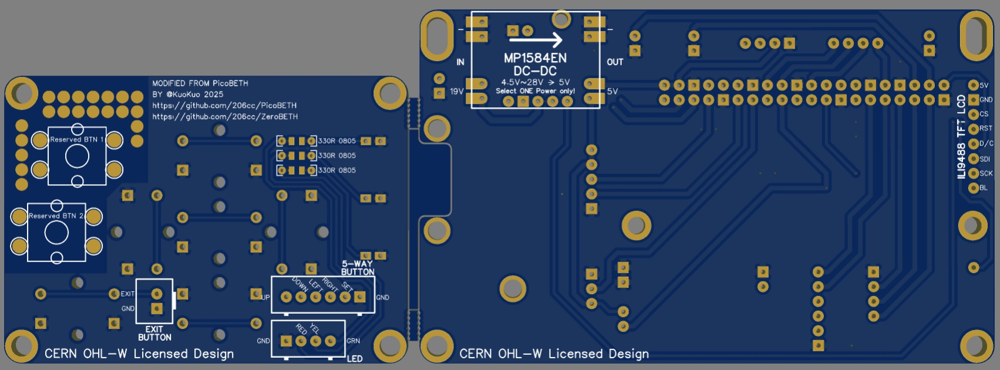
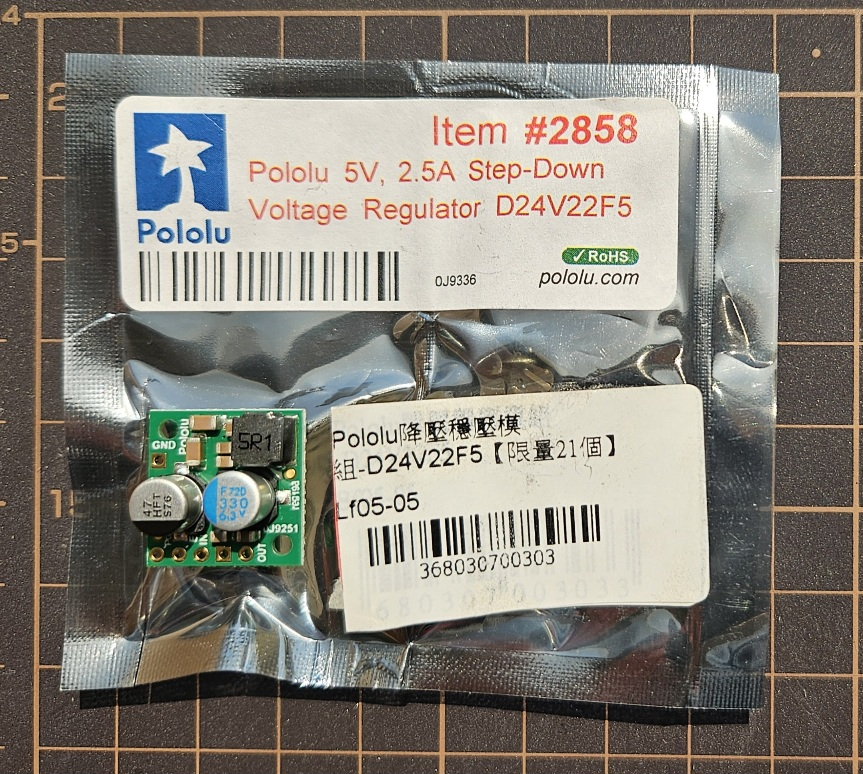

> [!TIP]
> Translated by ChatGPT  
> For the Chinese version, please click the  badge above.

# ZeroBETH

ZeroBETH is an extended version based on [PicoBETH](https://github.com/206cc/PicoBETH), upgrading the main controller from Raspberry Pi Pico to Raspberry Pi Zero 2 W, offering higher performance and more expansion capabilities. This variant retains the original design philosophy: economical, intuitive, and precise, while providing greater flexibility for advanced users and developers.

> [!TIP]  
> **This is a Pre (Preview) Version:** This version is an ongoing development and testing release. If you encounter any bugs or have suggestions for improvement, please report them to the project's GitHub discussion area.  

---

### Preview Videos

| Category | Description | Link |
|----------|-------------|------|
| Stringing Demo | Actual stringing demonstration using ZeroBETH | [Watch Video](https://youtu.be/M76PxqrGcno) |
| Comparison Demo | Performance comparison between ZeroBETH and PicoBETH (boot time, pulling response, etc.) | [Watch Video](https://youtu.be/osMxNlAMeeI) |
| New UI Design | Redesigned UI interface (LCD menu and screen refresh improvements) | [Watch Video](https://youtu.be/-ikYBSZI7xk) |

---

## Hardware Comparison: Pico vs Zero 2 W

| Item              | Raspberry Pi Pico W                    | Raspberry Pi Zero 2 W             |
|-------------------|----------------------------------------|-----------------------------------|
| Processor         | Dual-core 133MHz                       | Quad-core 1GHz                    |
| Memory            | 264KB                                  | 512MB                             |
| Wireless          | Wi-Fi 802.11n                          | Wi-Fi 802.11n                     |
| Storage           | 2MB                                    | microSD                           |
| OS Support        | None                                   | Linux-based (Raspberry Pi OS)     |
| Price (USD)       | Around $7.00                           | Around $20.00                     |

---

## Hardware Differences: PicoBETH vs ZeroBETH

### Load Cell Sensor

ZeroBETH is equipped with the NJ5 YZC-133 50kg Load Cell by default. If you are using a 20kg Load Cell, please switch to the 20kg setting from the engineering menu.

> [!CAUTION]  
> Please note that the maximum tension for the 20kg Load Cell should not exceed 40lb, as this may cause permanent damage.

### Sliding Platform

ZeroBETH is designed to work with the SGX 1610 sliding platform. With the new stepper motor driver program, it supports tension up to 70lb or more when used with the 1610 screw sliding platform.

### Heatsink

Since the Wi-Fi module of the Pico 2W is integrated within the CPU, tests have shown that when the CPU temperature exceeds 60°C, the Wi-Fi may become unstable. To improve cooling efficiency, it is recommended to install a heatsink. When the temperature exceeds 60°C, the system will automatically disable the Wi-Fi function. To reactivate it, please go to the menu and manually restart the Wi-Fi.

### Main PCB and Button PCB  
To upgrade to ZeroBETH, simply replace the main board and button board from PicoBETH EP6.

  
  

**PCB Gerber files:** [DOWNLOAD](docs/Gerber_ZeroBETH_1.2_2025-05-15.zip)  

#### DC-DC 5V Power Converter

Due to the inconsistent quality of **MP1584EN** modules on the market, many low-quality units may produce excessive **ripple**, which can cause **drift in the HX711 tension sensor**, especially on the more power-demanding **Raspberry Pi Zero 2W**.

To address this, the **ZeroBETH PCB version** includes dedicated pin headers designed to support the **Pololu D24V22F5 high-quality DC-DC power module**.

If you notice **frequent tension drift exceeding 5g during standby** when using an MP1584EN module, you may consider:

- Trying MP1584EN modules from other suppliers, or  
- Switching directly to the **Pololu D24V22F5 power converter** to improve stability.

Alternatively, you can also choose to:

- **Power the system directly via USB**, or  
- **Use the VCC IN header on the PCB** with another 5V DC-DC module.

> [!NOTE]  
> Tension drift is not only related to the power supply—it may also be caused by factors such as the HX711 amplifier module, the Load Cell sensor, or connection point impedance. It is recommended to use high-quality components to ensure stable performance.

  
Similar to the SparkFun HX711 module, a **genuine Pololu D24V22F5 DC-DC module** will come with original packaging and a labeled sticker. The typical price is around $10. If the price is unusually low, please be cautious of possible counterfeits.

#### BTN Button Board

Although the appearance of the ZeroBETH BTN button board is the same as that of PicoBETH, the circuit design is different, making them incompatible. ZeroBETH uses a pull-up design, while PicoBETH uses a pull-down design.

> [!CAUTION]  
> Please note that the PicoBETH button board **cannot** be used with ZeroBETH.

---

## Cost Difference

| Item             | PicoBETH Cost | ZeroBETH Cost         | Notes                             |
|------------------|---------------|------------------------|-----------------------------------|
| Main Controller  | $7            | Around $20.00          | Based on Taiwan retail pricing    |
| Storage          | None          | Around $5 (16GB microSD) | Minimal capacity is sufficient    |
| CPU Cooling    | Not required  | Approx. $1.5          | Recommended, not mandatory |

---

## Software Differences: PicoBETH vs ZeroBETH

### PicoBETH: Cost-effective and reliable

PicoBETH has been tested over a long period and validated by users. It offers stable performance and great value, ideal for entry-level stringing machines. It meets the needs of users who don’t require advanced features.

### ZeroBETH: Feature-rich and developer-friendly

- **OTA Firmware Update:** Automatically downloads and installs updates via Wi-Fi.
- **Faster Screen Refresh:** Improved performance leads to smoother screen updates. UI is redesigned.
- **Samba File Sharing:** Edit source code and settings over the local network, no cable needed—ideal for development.

### ZeroBETH Software Roadmap

| Version | Display Type     | Description                                                             |
|---------|------------------|-------------------------------------------------------------------------|
| v1      | 2004 LCD         | Redesigned UI and menu system                                           |
| v2      | 4" ILI9488 LCD   | Full-color 480x320 IPS LCD for an intuitive and advanced GUI. To be developed after v1 is complete |

---

## Feature Comparison Table

| Feature             | PicoBETH         | ZeroBETH         | Notes                                           |
|---------------------|------------------|------------------|------------------------------------------------|
| Tension Accuracy     | ±0.05 lb         | ±0.05 lb         | Maximum tension fluctuation after stabilization |
| Sampling Rate        | ≥80Hz            | ≥80Hz            | Depends on SparkFun HX711 module               |
| Pulling Frequency    | Lower            | Higher           | Faster processing improves response time       |
| OTA Firmware Update  | v2.80E and above | Supported        | Update firmware via Wi-Fi                      |
| UI Interface         | Minimal          | Redesigned       | v1: 2004 LCD, v2: 4" full-color IPS LCD        |

---

## Installation Guide

1. **Assembling the Machine Body**  
   - Follow the instructions from the [PicoBETH](https://github.com/206cc/PicoBETH) project to assemble the machine body.  
   - During the assembly process, replace **EP6** from PicoBETH with the [**ZeroBETH Main PCB and Button PCB**](#main-pcb-and-button-pcb).  

2. **Firmware Burning**  
   - Burn the **ZeroBETH firmware** to the microSD card.  
   - Insert the **Raspberry Pi Zero 2 W** and install it into the machine for normal operation.  
   - For detailed burning steps, please refer to: [Build and Install](docs/build_and_install.md)  

---

## Notes

### 1. HW3D Version Assembly Adjustment

When using the 3D printed version, the 5-way button socket on the ZeroBETH PCB mainboard interferes with Part 7, causing the top cover to not fit properly.  
Please mark the position as shown in the photos below, and modify a groove of about 10mm before installation.

  

The updated version of Part 7 has been uploaded to Thingiverse:  
🔗 [Thingiverse](https://www.thingiverse.com/thing:6913170/)

### 2. Clamp Head Return Control Difference

In the preview version of ZeroBETH, only the "Cancel" button is used to control the return of the clamp head.  
In contrast, PicoBETH provides two control methods:  
- A button on the clamp head itself  
- The "Exit" button on the panel  

After the string pulling action is completed, pressing the "Exit" button will return the clamp head to its initial position.

### 3. System Shutdown Procedure

PicoBETH uses an MCU (microcontroller) as the main controller, so it is safe to power it off directly.  
However, ZeroBETH runs a full Linux operating system, and it is strongly recommended to shut it down properly using the **"4-1 Shutdown"** option in the menu to avoid system corruption.

Once the shutdown process is complete, the green LED on the Raspberry Pi Zero 2W board will turn off (the 2004 LCD will remain on — this is normal).  
In general, it is safe to disconnect power about 10 seconds after pressing the shutdown button.

---

## Additional Documentation

> The following documents are still being organized and written. Detailed content will be added upon completion.

- [Operation and Configuration Guide](docs/Operation_and_Settings_Guide.md)
- [Developer Guide](docs/developer_guide.md)

---

## Support

For questions, please post in the [PicoBETH Discussions](https://github.com/206cc/PicoBETH/discussions).

---

## Acknowledgements

- [HX711 Raspberry Pi HX711 Python Bindings](https://github.com/endail/hx711-rpi-py)
- [RPI-PICO-I2C-LCD](https://github.com/T-622/RPI-PICO-I2C-LCD), modified for Raspberry Pi Zero 2 W

---

## License

- **Source Code License:** GNU General Public License v3.0 (GPLv3)  
- **Hardware Design License:** CERN Open Hardware Licence v2 – Weakly Reciprocal (CERN-OHL-W)
