# 操作與設定指南

本說明文件將介紹 ZeroBETH Pre 版本的操作與設定方式，其 **主畫面**、**張力設定畫面**、**張緊中畫面** 與 PicoBETH 幾乎相同，建議先參考原始 [PicoBETH 操作說明文件](https://github.com/206cc/PicoBETH/blob/main/1.Operation_and_Settings_Guide.cht.md)。

---

## 與 PicoBETH 差異

ZeroBETH 相較於 PicoBETH，在 **主畫面** 有以下幾項主要差異：

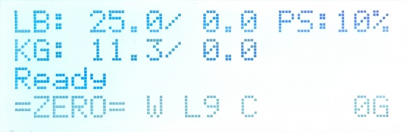

1. 若成功連上 Wi-Fi，會於下方狀態列顯示 `W`。
2. 移除了原有的網球模式 `T`（ZeroBETH 不分羽球/網球模式，僅透過工程模式設定最大張力）。

> [!NOTE]
> ZeroBETH 增加的網路功能，目前僅供 OTA 更新使用。  

> [!WARNING]
> 若 CPU 溫度超過 60°C，系統將自動關閉 Wi-Fi 以保護穩定性。

---

## 設定畫面總覽

Zero 2 W 擁有更高效能，因此在 2004 LCD 顯示上幾乎無延遲，並重新設計了 UI 介面。

### 1. 一般設定頁面

#### 1-1 機頭速度
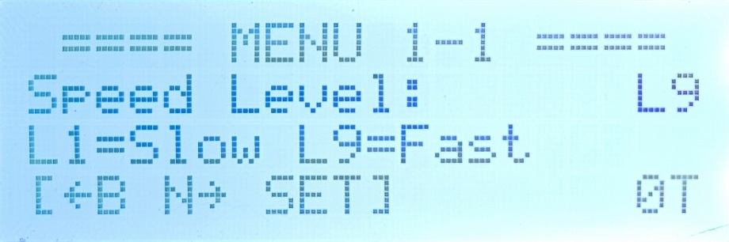

#### 1-2 恆拉開關
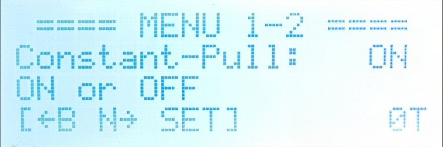

#### 1-3 蜂鳴器開關

#### 1-4 張力單位
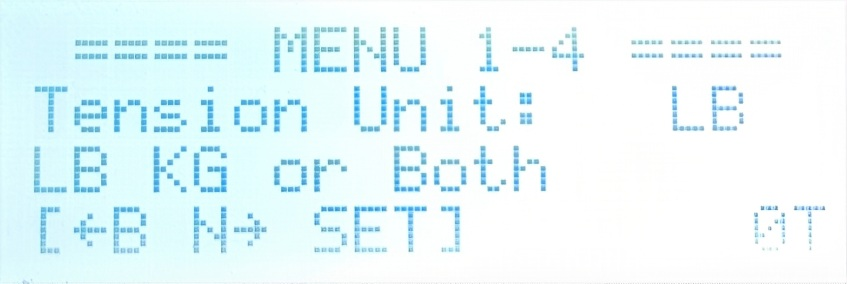

---

### 2. 進階設定頁面

#### 2-1 HX 校正係數
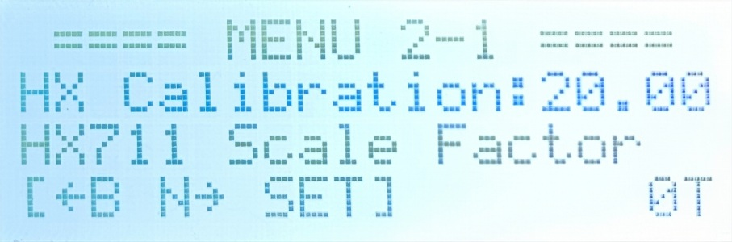

#### 2-2 Wi-Fi 連線設定
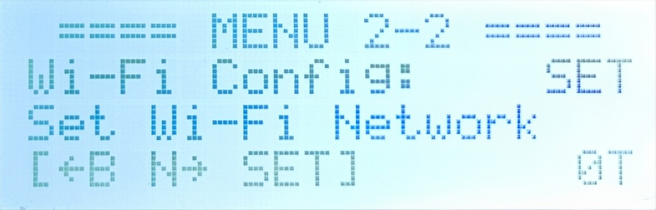

---

### 3. 系統資訊與網路功能

#### 3-1 Wi-Fi IP 位址
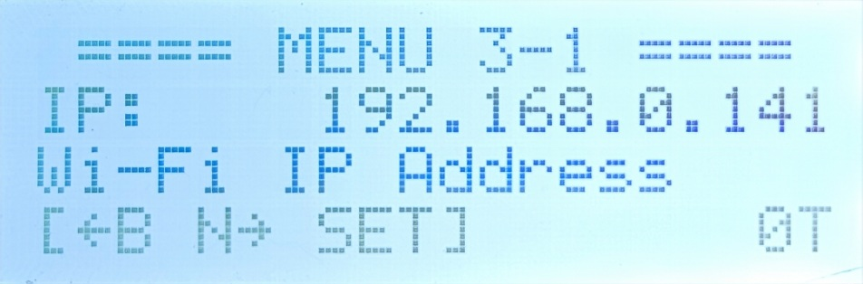

#### 3-2 OTA 線上更新
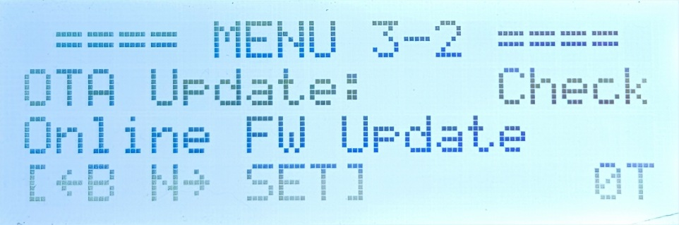

#### 3-3 系統版本資訊
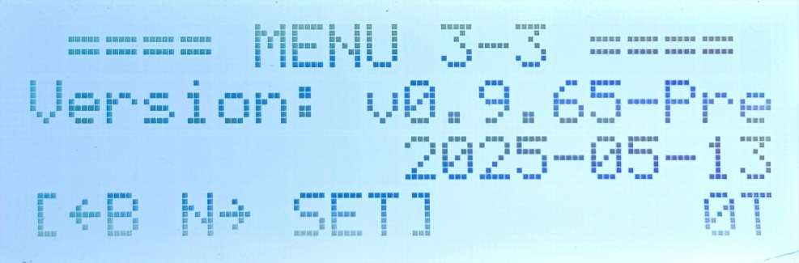

> [!NOTE]
> 於本頁面快速按下 DOWN 鍵超過 5 次，返回主畫面並重新進入，即可進入「工程模式」第 9 頁選項。

---

### 4. 電源控制

#### 4-1 重啟／關機
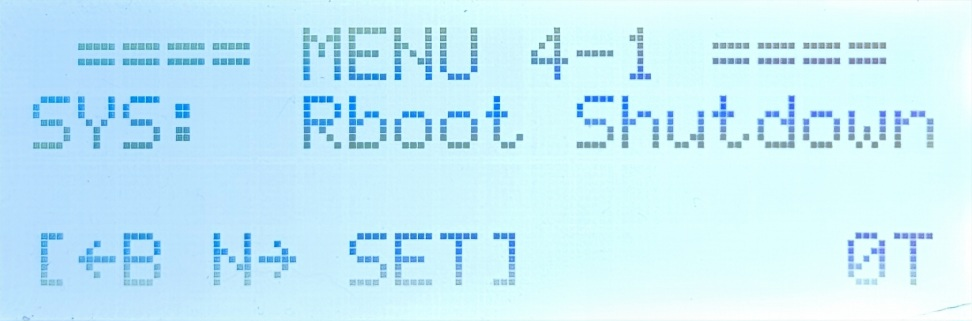

PicoBETH 可直接斷電無虞，但 ZeroBETH 執行的是完整 Linux 作業系統，**建議透過此選單安全關機**。

- 關機後 Raspberry Pi Zero 2 W 的綠色 LED 燈會熄滅。
- 2004 LCD 背光保持常亮為正常現象。
- 約 10 秒後可安全斷電。

---

## 工程模式（9-x）

### 9-1 荷重元（Load Cell）選擇
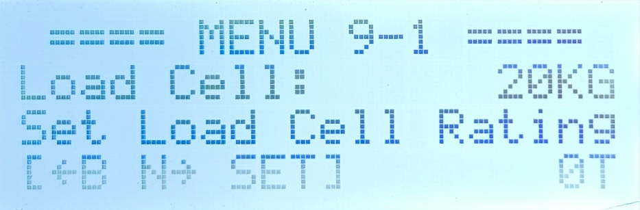

請選擇正確規格（20kg / 50kg）。ZeroBETH 建議搭配 SGX 使用 50kg 感測器，可支援最高 70lb 張力。

> [!WARNING]
> 請務必執行正確的張力校正流程，否則可能損壞球拍。

### 9-2 最大張力設定
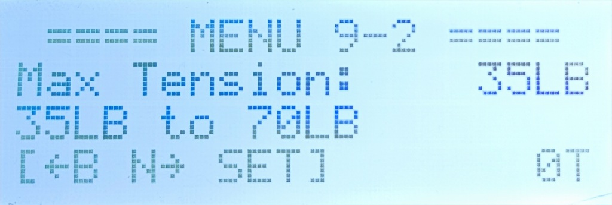

依據荷重元類型與滑台規格設定最大張力：
- 20kg Load Cell + SGX 1610 平台：上限建議 40lb
- 50kg Load Cell + SGX 1610 平台：上限建議 70lb
- 50kg Load Cell + GX80 1605 平台：支援至 90lb+（極限 130lb）

> [!WARNING]
> 超過 70lb 請確保結構強度可承受高張力。

> [!WARNING]
> 使用張力超過 Load Cell 額定負載，可能導致感測器損壞並顯著降低壽命。

### 9-3 滑台螺杆規格
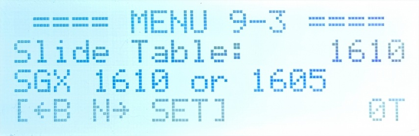

請選擇對應規格：`1605` 或 `1610`。

### 9-4 開機計數器
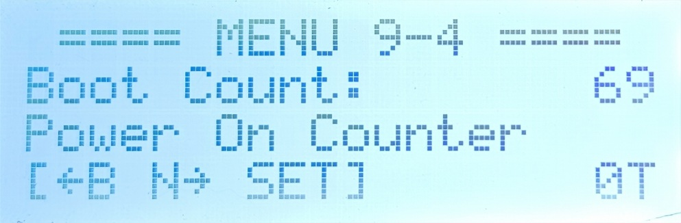

顯示設備累計開機次數。

### 9-5 HX711 取樣頻率
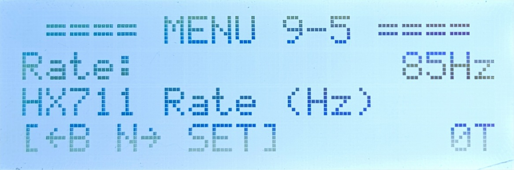

低於 80Hz 系統將禁止啟動。  
SparkFun HX711 通常在 85Hz 以上。

### 9-6 HX711 飄移值
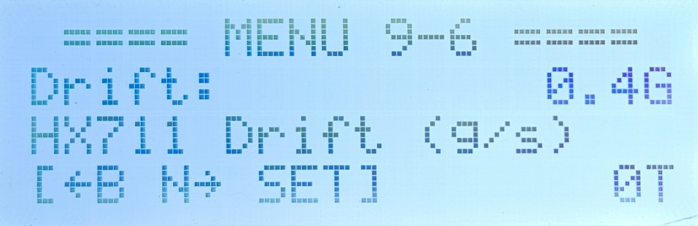

開機時若飄移值 > 2g，系統將禁止啟動。  
SparkFun HX711 通常為 0.3g ~ 0.5g。

### 9-7 HX711 取樣可靠率
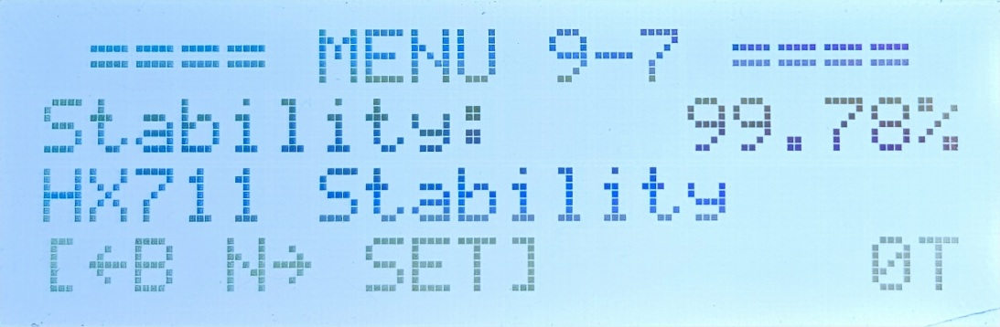

ZeroBETH 使用的 `hx711-rpi-py` 函式庫偶有離群值，正常可靠率應在 99.5% 以上，若低於 99.0% 系統將禁止啟動。

> [!NOTE]
> PicoBETH 使用的 hx711 函式庫不受此影響，可靠率為 100%。

### 9-8 開發使用密碼
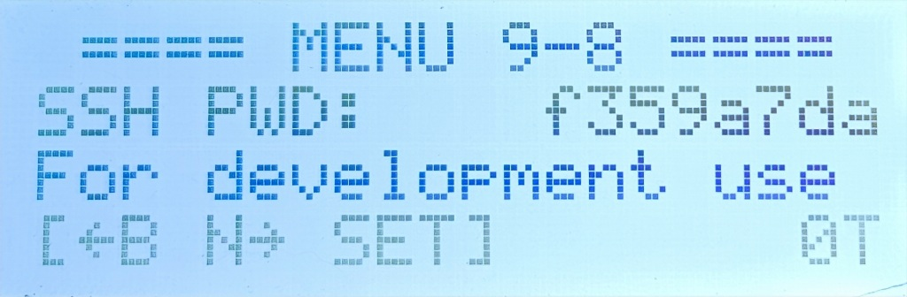

請參閱 [開發者指南](developer_guide.cht.md)
