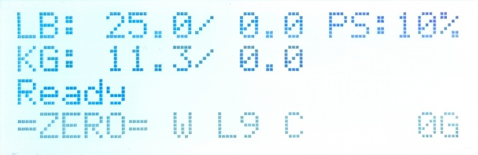
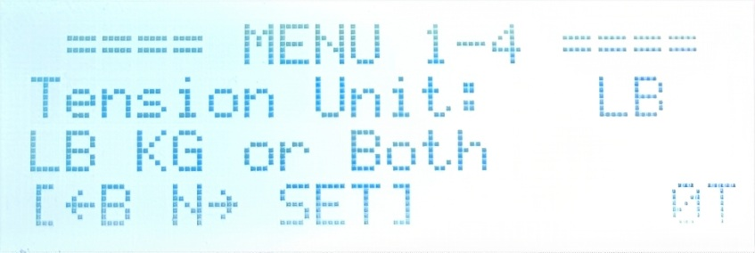
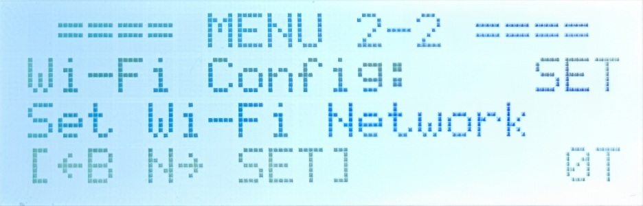
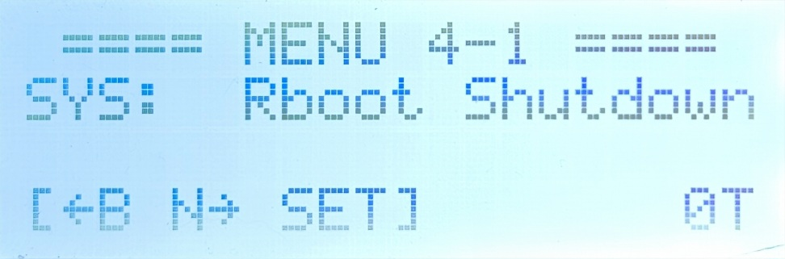
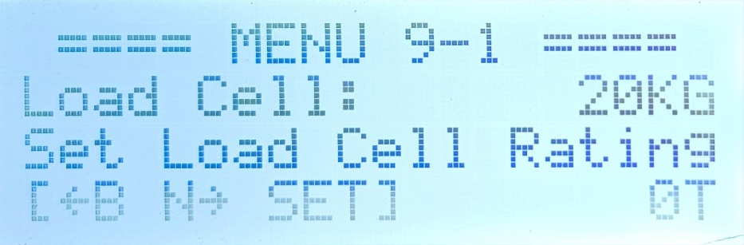
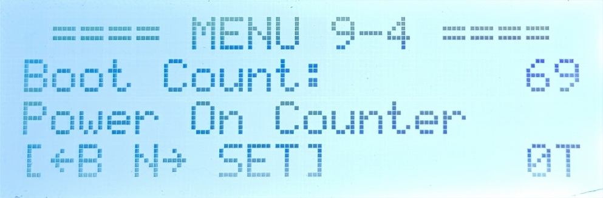
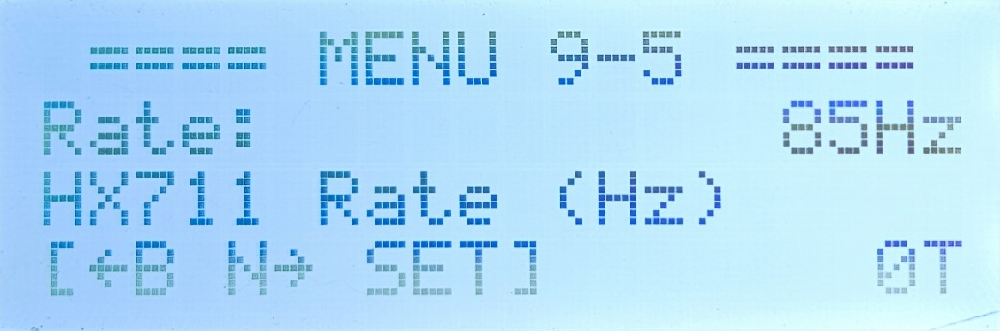
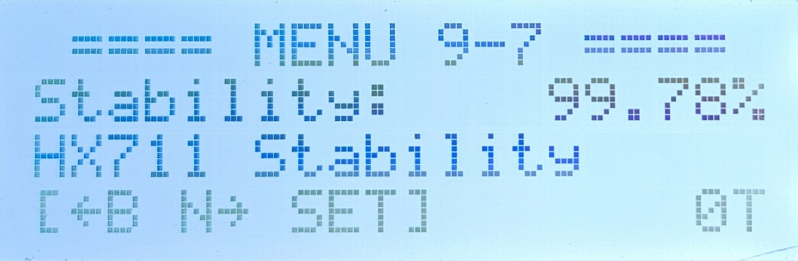

# Operation and Settings Guide

This document describes the operation and settings of the ZeroBETH Pre version. The **main screen**, **tension setting screen**, and **tensioning screen** are almost the same as those in PicoBETH. It is recommended to first refer to the original [PicoBETH Operation Guide](https://github.com/206cc/PicoBETH/blob/main/1.Operation_and_Settings_Guide.md).

---

## Differences from PicoBETH

Compared with PicoBETH, ZeroBETH has the following main differences on the **main screen**:

1. If Wi-Fi is successfully connected, a `W` will be displayed in the bottom status bar.
2. The original tennis mode `T` has been removed (ZeroBETH does not differentiate between badminton/tennis modes; the maximum tension is set via engineering mode).

> [!NOTE]
> The newly added network feature of ZeroBETH is currently used only for OTA updates.

> [!WARNING]
> If the CPU temperature exceeds 60°C, the system will automatically disable Wi-Fi to maintain stability.

---

## Settings Overview

Zero 2 W has higher performance, so the display on the 2004 LCD is almost real-time. The UI has been redesigned.

### 1. General Settings Page

#### 1-1 Head Speed  

#### 1-2 Constant Pull Toggle  

#### 1-3 Buzzer Toggle  

#### 1-4 Tension Unit  

---

### 2. Advanced Settings Page

#### 2-1 HX Calibration Coefficient  

#### 2-2 Wi-Fi Connection Settings  

---

### 3. System Info and Network Functions

#### 3-1 Wi-Fi IP Address  

#### 3-2 OTA Online Update  

#### 3-3 System Version Info  

> [!NOTE]
> Quickly press the DOWN key more than 5 times on this page, return to the main screen, then re-enter to access Engineering Mode page 9.

---

### 4. Power Control

#### 4-1 Reboot / Shutdown  

PicoBETH can be safely powered off directly, but ZeroBETH runs a full Linux OS. **It is recommended to shut down properly via this menu**.

- After shutdown, the green LED on the Raspberry Pi Zero 2 W will turn off.
- The 2004 LCD backlight will remain on, which is normal.
- You can safely cut power after about 10 seconds.

---

## Engineering Mode (9-x)

### 9-1 Load Cell Selection  

Please select the correct specification (20kg / 50kg). ZeroBETH recommends using a 50kg sensor with SGX, which supports up to 70lb tension.

> [!WARNING]
> Be sure to follow the correct tension calibration procedure, otherwise the racket may be damaged.

### 9-2 Max Tension Setting  

Set the maximum tension according to the load cell type and platform spec:
- 20kg Load Cell + SGX 1610 platform: recommended max 40lb
- 50kg Load Cell + SGX 1610 platform: recommended max 70lb
- 50kg Load Cell + GX80 1605 platform: supports 90lb+ (limit 130lb)

> [!WARNING]
> For tension over 70lb, ensure the structure can withstand high tension.

> [!WARNING]
> Applying tension beyond the load cell's rated capacity may damage the sensor and significantly reduce its lifespan.

### 9-3 Sliding Table Screw Spec  

Please select the appropriate spec: `1605` or `1610`.

### 9-4 Boot Counter  

Displays the total number of times the device has been powered on.

### 9-5 HX711 Sampling Rate  

The system will not start if the rate is below 80Hz.  
SparkFun HX711 is typically above 85Hz.

### 9-6 HX711 Drift Value  

If the drift value > 2g at startup, the system will not start.  
SparkFun HX711 typically ranges from 0.3g to 0.5g.

### 9-7 HX711 Sampling Reliability  

ZeroBETH uses the `hx711-rpi-py` library, which occasionally produces outliers. Normal reliability should be above 99.5%; if below 99.0%, the system will not start.

> [!NOTE]
> The hx711 library used in PicoBETH does not have this issue and maintains 100% reliability.

### 9-8 Developer Password  

Please refer to the [Developer Guide](developer_guide.md)
